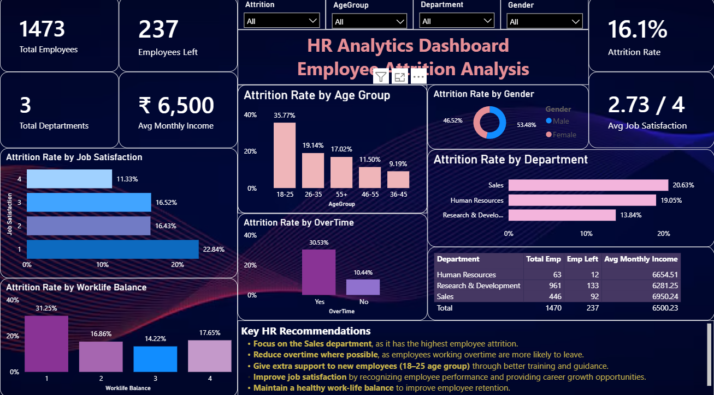

# 📊 HR Analytics and Employee Attrition Prediction

An End-to-End HR Analytics project that analyzes employee attrition using **Excel, SQL, Power BI, and Machine Learning**. The project transforms raw HR data into actionable business insights and builds a predictive model to identify employees who are likely to leave the organization.

---

## 📌 Project Overview

Employee attrition is one of the biggest challenges faced by organizations. This project performs complete HR data analysis and develops a Machine Learning model to predict employee attrition, helping HR teams make informed decisions and improve employee retention.

---

## 🎯 Business Objectives

- Analyze employee attrition patterns.
- Identify key factors influencing employee turnover.
- Build an interactive Power BI dashboard for HR insights.
- Predict employee attrition using Machine Learning.
- Provide data-driven recommendations for improving employee retention.

---

## 🛠️ Tech Stack

- **Excel** – Initial Data Review & Basic Formatting
- **SQL (PostgreSQL)** – Business Data Analysis
- **Power BI** – Dashboard Development & Data Visualization
- **Python** – Data Preprocessing, Exploratory Data Analysis (EDA), Machine Learning & Model Evaluation
- **Pandas**
- **NumPy**
- **Matplotlib**
- **Scikit-learn**
- **Jupyter Notebook**

---

# 📂 Repository Structure

```
HR-Analytics-and-Employee-Attrition-Prediction
│
├── Dataset
│   ├── HR_Analytics.csv
│   └── cleaned_hr_data.csv
│
├── Data_preprocessing
│   ├── HR_data_cleaning.ipynb
│   └── EDA_HR_data.ipynb
│
├── SQL_Analysis
│   └── Hr_analytics.sql
│
├── PowerBI_dashboard
│   ├── HR_Analytics_Dashboard(1).pbix
│   └── Dashboard.png
│
├── Machine_Learning
│   └── Employee_Attrition_Prediction(1).ipynb
│
└── README.md
```

---

## 📊 Dashboard Highlights

### KPIs
- Total Employees
- Employees Left
- Attrition Rate
- Average Monthly Income
- Average Job Satisfaction
- Total Departments

### Visualizations
- Attrition by Department
- Attrition by Age Group
- Attrition by Gender
- Attrition by Job Satisfaction
- Attrition by Work-Life Balance
- Attrition by Overtime
- Department-wise Summary Table
---
## 📊 Dashboard Preview


---

# 🤖 Machine Learning

## Problem Type

Binary Classification

**Target Variable**

- Attrition
  - Yes
  - No

---

## Models Evaluated

- Logistic Regression
- Decision Tree Classifier
- Random Forest Classifier

---

## Best Model Performance

| Metric | Score |
|---------|-------|
| Accuracy | **89.15%** |
| ROC-AUC Score | **0.85** |

---

## Key Business Insights

- Sales department has the highest employee attrition.
- Employees working overtime are more likely to leave.
- Employees aged **18–25** show the highest attrition rate.
- Lower job satisfaction is associated with higher employee turnover.
- Better work-life balance contributes to improved employee retention.

---

# 💡 HR Recommendations

- Focus retention strategies on the Sales department.
- Reduce excessive overtime wherever possible.
- Provide additional support and mentoring to new employees.
- Improve employee recognition and career growth opportunities.
- Promote a healthy work-life balance to increase employee satisfaction.

---

# 🚀 Project Workflow

```
Raw Dataset
      ↓
Excel Data Cleaning
      ↓
Exploratory Data Analysis
      ↓
SQL Business Analysis
      ↓
Power BI Dashboard
      ↓
Machine Learning Prediction
      ↓
Business Recommendations
```

---

# 📚 Skills Demonstrated

- Data Cleaning
- Exploratory Data Analysis
- SQL Query Writing
- Data Visualization
- Dashboard Design
- Business Intelligence
- Feature Encoding
- Machine Learning
- Model Evaluation
- Predictive Analytics

---

# 👩‍💻 Author

**Shivani Garg**

B.Tech (AI & ML)

Aspiring Data Analyst | Machine Learning Enthusiast

---

⭐ If you found this project useful, consider giving it a star!
